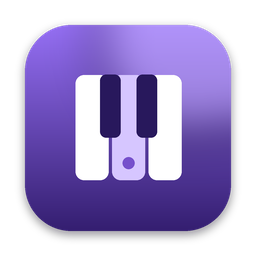

<p align="center">
  
</p>

<h1 align="center">Keygrid</h1>

<p align="center">Key, BPM, reverb and delay times, all in one drag and drop.<br>Keygrid gives bedroom artists and engineers their time back, so they can focus on the music.</p>

<p align="center"><a href="https://github.com/ChrisCollins24/KeyGrid/releases/latest"><b>⬇ Download Keygrid for Mac</b></a></p>

<p align="center">Open the .dmg, drag Keygrid into Applications, and the first time click <b>Open Anyway</b> in System Settings → Privacy &amp; Security.</p>

---

## Why Keygrid

Every artist starts somewhere, and for most of us that's a bedroom setup with little or no budget. Before a single vocal is recorded, there's a checklist: find the BPM, identify the key, work out reverb and delay times that fit the tempo. That usually means bouncing between several websites and apps, each answering one question. It takes time, it breaks focus, and it pulls energy away from what matters most: the music, the artist, and the moment in the session.

Keygrid brings all of it into one place. Drag in a beat, and in seconds you have the tempo to four decimal places, the key and its relative key, vocal reverb and delay settings timed to the track, and a health check on the beat itself. No tabs, no guesswork, no outsourcing.

Keygrid is built for the engineers and artists who are just getting started, and the ones who've been at it for years. It gives you back the time and energy to spend on the work you love.

## What you get

- **Tempo** to four decimal places, with ½× / 2× and a click track to check it by ear
- **Key and relative key**, with Open Key codes and a playable piano showing the scale
- **Vocal reverb** settings for ValhallaVintageVerb, timed to the BPM
- **Vocal delay** times for every common note value
- **Beat health:** peak, clipping, loudness (LUFS), dynamics and mono compatibility
- **Previous:** a saved list of every song you've analyzed, ready for invoices
- Runs on Apple Silicon and Intel Macs. Your audio never leaves your computer.

---

## Building Keygrid yourself

You don't need this section to use Keygrid. Just use the download link above. These steps are for building the app from this source code, which runs on both Apple Silicon (M1–M4) and Intel Macs.

You build it **once**, then copy the installer to any Mac and install it there. The other Macs don't need any of the tools below.

There are two ways to build it. Pick one.

---

### Option A: Build it on your Mac (about 15 minutes the first time)

Open **Terminal** (Applications → Utilities → Terminal) and run these one at a time.

**1. Install Apple's command-line tools** (a window pops up; click Install and wait for it to finish)

```
xcode-select --install
```

**2. Install Rust** (press Enter to accept the defaults, then close and reopen Terminal)

```
curl --proto '=https' --tlsv1.2 -sSf https://sh.rustup.rs | sh
```

**3. Add the Intel target** so one build runs on every Mac

```
rustup target add aarch64-apple-darwin x86_64-apple-darwin
```

**4. Install Node.js** from https://nodejs.org (the LTS download, a normal installer).

**5. Build Keygrid.** Unzip this folder somewhere easy, like your Desktop, then:

```
cd ~/Desktop/keygrid-app
npm install
npm run build
```

The first build takes a few minutes. When it finishes, your installer is here:

```
src-tauri/target/universal-apple-darwin/release/bundle/dmg/Keygrid_1.0.0_universal.dmg
```

(Type `open src-tauri/target/universal-apple-darwin/release/bundle/dmg` to open that folder in Finder.)

---

### Option B: Let GitHub build it (no tools on your Mac)

1. Make a free account at https://github.com and create a new **private** repository called `keygrid`.
2. On the repository page, click **uploading an existing file** and drag in everything in this folder, including the hidden `.github` folder. (On a Mac, press **Cmd + Shift + .** in Finder to show hidden files.)
3. Click the **Actions** tab → **Build Keygrid for Mac** → **Run workflow**.
4. After about 10 minutes, open the finished run and download **Keygrid-mac** at the bottom. It's a zip with the `.dmg` inside.

GitHub gives private repositories free build minutes every month, far more than this needs.

---

## Installing on any Mac

1. Open the `.dmg` and drag **Keygrid** into **Applications**.
2. The first time only: because the app isn't signed with a paid Apple Developer account, macOS will block it.
   - **macOS 15 (Sequoia) or newer:** try to open Keygrid, click **Done**, then go to **System Settings → Privacy & Security**, scroll down, and click **Open Anyway** next to Keygrid.
   - **macOS 14 or older:** right-click Keygrid in Applications → **Open** → **Open**.
3. After that it opens normally, like any other app.

If macOS ever says the app "is damaged", run this once in Terminal and then open it again:

```
xattr -dr com.apple.quarantine /Applications/Keygrid.app
```

---

## Where your song history is saved

The **Previous** list is saved on each Mac here:

```
~/Library/Application Support/com.keygrid.analyzer/history.json
```

It stays when you quit or update the app. To move your history to another Mac, copy that file into the same place on the new Mac.

---

## Desktop extras

- **Keep on top:** the button in the top bar keeps Keygrid floating above Pro Tools. It remembers your choice.
- **Works offline:** everything, including the fonts, is inside the app.

---

## Updating the app later

Change the app files in `scripts/` (`page.template.html` and `analysis.js`), bump the `version` in `package.json` and `src-tauri/tauri.conf.json`, and build again with Option A or B.

## Signing it later (optional)

To share Keygrid without the "Open Anyway" step, or to sell it, you'll need an Apple Developer account ($99/year) to sign and notarize the app. Nothing in the app itself has to change; only the build settings do.

## What's in this folder

| Path | What it is |
|---|---|
| `scripts/page.template.html` | The Keygrid interface |
| `scripts/analysis.js` | The BPM, key and beat health engine |
| `scripts/build-page.js` | Combines those into `src/index.html` for the app |
| `src/` | The finished app page and its fonts |
| `src-tauri/` | The Mac app shell (window size, history file, keep on top, icon) |
| `.github/workflows/build-mac.yml` | The GitHub build recipe for Option B |

## What's new

See [CHANGELOG.md](CHANGELOG.md) for every version's changes. Each download on the [Releases page](https://github.com/ChrisCollins24/KeyGrid/releases) lists what changed in that version.

## Credits

Keygrid is built with [Tauri](https://tauri.app), the Outfit, Figtree and IBM Plex Mono fonts, and 280+ open-source Rust libraries. Its analysis builds on published research: Ellis (2007) for beat tracking, the Krumhansl–Kessler and Temperley key profiles for key detection, and ITU-R BS.1770 for loudness. Designed and directed by Christian Collins and written with the help of Claude by Anthropic. Full credits and license texts are in [THIRD-PARTY-NOTICES.md](THIRD-PARTY-NOTICES.md), which also ships inside the app.

Keygrid is not affiliated with or endorsed by Valhalla DSP, Avid (Pro Tools), Antares (Auto-Tune), Celemony (Melodyne) or Mixed In Key. Product names are trademarks of their respective owners and are mentioned only to describe compatibility.

## License

Copyright © 2026 Christian Collins. All rights reserved. Keygrid is proprietary software; see [LICENSE](LICENSE). No part of it may be copied, modified or redistributed without written permission.
